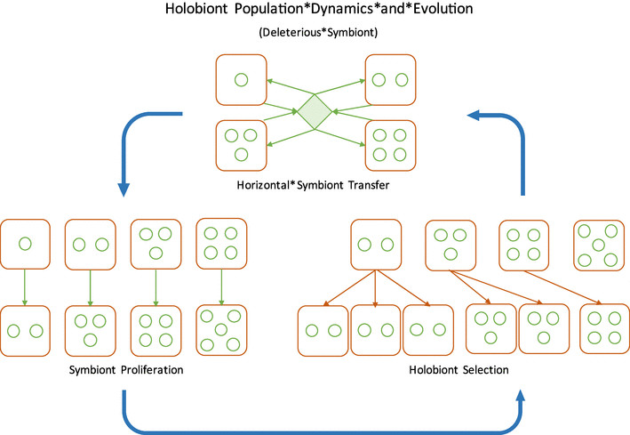

```{r setup, include=FALSE}
knitr::opts_chunk$set(echo = TRUE)
```

## Evolving Ecology: Modelling Evolution without the "organism"

Imagine a school of tuna. Let’s say one of these fish has a tail with a slightly more hydrodynamic geometry, letting it beat its peers to prey and evade predators more easily. This fish will have better odds of surviving long enough to reproduce. All else being equal, its lineage will take up a greater and greater proportion of the population over the course of generations.

Someone with a basic understanding of biology might describe a scenario like the one above if asked to give an example of how evolutionary natural selection works. A new trait emerges that leaves the organism better equipped to produce offspring. A tuna in this view is a discrete organism with some degree of fitness as defined by the constraints of its environment.

But the organism, as defined in the conventional sense of “one genome in one body,” is not necessarily as clear-cut a delineation of biological organization as one might think at first glance. This first struck me in 2014 or 15, when I was a teenage beekeeper and budding biologist. Worker bees do not (except in some rare cases) reproduce. They have distinct bodies, at least in the conventional sense, and they have their own genomes, but they do not mate or lay eggs. With my understanding of evolution at the time, I couldn’t make sense of it - how could an animal that lives just to die ever evolve? Eventually, I came to this conclusion: even though the worker bees are not reproducing directly, through a germline originating in their own bodies, they are participating in a process leading to the production of related individuals. In terms of its relationship to selection, an individual bee is more like an organ than a conventional organism. Your liver, for example, keeps you alive by processing toxins, allowing you the potential to reproduce and create more livers. The hive, in this case, behaves more like the conventional organism in terms of how it responds to selection - except that it is made up of tens of thousands of bodies, instead of just one!

These boundaries become even more blurred when thinking about colonial organisms like corals, where each polyp is its own complete ‘body,’ but is connected by living tissue to the other polyps making up the coral. Is the whole coral the organism? Is each polyp? Bouchard (2011) makes this same point at length, though he refers to clonal groves of quaking aspen. The boundary between individual and group is much harder to define than we might initially think.

This point was driven home for me when I read a 2015 paper by Gilbert et al. called “Eco-Evo-Devo: developmental symbiosis and developmental plasticity as evolutionary agents.” One sentence in particular struck me - “the holobiont may be an important unit of evolutionary selection, whereby selection selects ‘teams’ containing many genomes and species.” The precise definition of the holobiont is not universally agreed upon, but can be broadly understood as a biological organization consisting of “an animal or plant host together with all the microbes living on or in it” (Roughgarden et al., 2018).

I’ll be clear about what’s interesting here - they are talking about evolutionary selection acting not on an organism, population, or colony, but on a functional unit comprised of members of different species. With our conventional understanding of how natural selection works, this kind of thinking seems almost blasphemous. But it makes an intuitive kind of sense - if conventional organisms are collaborating intimately towards mutual survival, wouldn’t those relationships contribute to relative fitness? And if selection is acting on the relationships, then how could it not be acting on the higher order of organization formed by those relationships? Especially when we consider the spectrum of endosymbiosis, which ranges from parasites ingested during a lifetime to organelles such as mitochondria which are so integrated that they are transmitted through the germline and are ubiquitously included in the conventional organism concept (Sagan, 1967). Corals provide a special example of how blurred these lines can be. Many corals rely on photosynthetic endosymbiont dinoflagellates called zooxanthellae, and while most species acquire these endosymbionts from the environment, some corals actually include zooxanthellae in their germ cells (Roughgarden et al., 2018)!

In more recent work, Gilbert writes: “the ontological basis of the organism is undergoing a profound change. Indeed, the recent recognition of the ubiquity of symbiosis has challenged the traditional notions of biological individuality and requires a shift in the metaphysics undergirding biology, in which a philosophy of the organism must be characterized by ecological dialectics ‘‘all-the-way-down” (Gilbert & Tauber, 2016).” While the appearance of the word metaphysics might raise the hackles of those who consider themselves hard scientists, the point that the authors are making is that as our understanding of biology improves, the concept of a discrete organism seems more and more like an arbitrary designation, as both the holobiont and the conventional ‘body’ are better thought of as nested orders of biological organization, with relationships within and across orders. 

Gilbert is a developmental biologist with an interest in immunology (hence “evo-eco-devo”) - therefore his work begins at the scale of the conventional organism, and looks inwards for ecology - “ecological dialectics “all-the-way-down.”” I’m an ecologist, so I’m more interested in the inverse - that is to say, evolutionary selection “all-the-way-up.” To put it more explicitly, I’m interested in these questions:

1. What would it mean to say that evolution acts upon an ecosystem?

2. How would one model concatenated evolutionary systems - i.e. evolving systems that are environments relative to their constituents?

It might feel like there’s a clear difference between a host and its endosymbionts and a traditional ecosystem, but in terms of their abstract relationships to evolutionary selection, I’m not at all convinced that there is. If we accept that selection can act on the holobiont, we are accepting that selection acts on the higher-order biological unit formed by the relationships between interacting constituents of different species. It’s not clear to me why those dynamics should stop at the edge of the holobiont host’s boundary. 

Joan Roughgarden, the iconoclastic evolutionary biologist best known for her controversial critique of sexual selection, has in recent years focused on biological collaborations, with a special interest in the evolution of holobionts. In a 2018 paper with Gilbert and other coauthors, she introduced a schematic model of holobiont evolution, which she has then been expanded upon in more recent work (Roughgarden, 2019, 2022; Roughgarden et al., 2018).

In the first version of the model, identical hosts contain different numbers of identical deleterious microbes. Microbes can be exchanged horizontally between holobionts via an environmental pool, microbes can multiply within a host, and holobionts can reproduce, with reproductive success determined by number of internal microbes. I have included a figure from Roughgarden et al. (2018) below which illustrates this model. 





In her 2019 article (which is available as a preprint and has not been published to my knowledge) Roughgarden presents two models - one in which microbes are distributed only through vertical transmission, and one in which they are transmitted only through horizontal transmission. She uses these models to illustrate that holobiont selection can plausibly take place through two models of inheritance: “collective inheritance whereby juveniles inherit a sample of the collected genomes from all parents as contrasted with lineal inheritance whereby juveniles inherit the genomes from only their own parents (Roughgarden, 2019).” 

In her 2022 article (also a preprint) she introduces a model including two microbial strains, and a host ability to include/exclude microbes based on their relative altruism via a process called Host Orchestrated Species Selection, or HOSS (an analogy for immunity as described by Gilbert) (Gilbert & Tauber, 2016; Roughgarden, 2022). It also presents an improved model for holobiont sampling from the microbial source pool.

These models are highly abstracted, but provide a useful base structure with which to think about the evolution of multispecies associations. There are some nice tie-ins to tools we’ve discussed in class. Lotka-Volterra is specifically invoked as a potential tool for managing multiple species of microbes, and UNTB has obvious applications when imagining holobionts drawing microbial strains from a source pool. 

To expand these to generalizable models of ecosystem evolution, the main feature that would need to be added is changes to the ‘host,’ which would impact the fitness landscape for the microbial assemblage. In a holobiont setting, this would represent evolution of the host, while in an ecosystem this could represent abiotic factors / external forcings, such as climate change or natural disaster. Moving beyond the 2-layer model of host-endosymbiont towards deeper models with more concatenation could also more accurately represent the Russian doll view of biological organization. An analytic method that could define relevant units in systems without predefined boundaries would also be really useful.

In Andrea Wulf’s book The Invention of Nature, (2015) she describes 18th century naturalist Alexander von Humboldt’s as the first (at least in the European tradition) to view ‘nature’ as an interconnected system. The naturalists of that era focused primarily on describing the complexity  of the natural world. With the advent of genetics, biology took a reductionist, gene-oriented turn, which reached its peak in both academic and popular circles in the aftermath of the publication of Dawkins’s tragically popular book The Selfish Gene. Reductionism in biology focused on developing simple explanations of natural phenomena based on abstract simplification and reasoning from first principles. In the past several decades, however, there has been increased acknowledgment that the roles of complexity and emergent properties are of critical importance in almost every area of biology (Mitchell, 2009). 

I give this crudely oversimplified history of biological perspectives to provide context for the following point: It has become increasingly clear that the designation of the ‘individual’ organism is largely arbitrary, yet our basic approach to evolution and ecology relies upon it.  As Gilbert bombastically puts it, “most (if not all) ‘‘individual’’ animals are increasingly appreciated as being organized consortia of hundreds of species living in a symbiotic commune (Gilbert & Tauber, 2016).” While the discrete organism is a convenient abstraction and allows description of many biologically interesting dynamics, it is not ‘real’ in a meaningful sense. It’s worth asking what it would mean to move towards a view of biology that embraces a ubiquitously disoriented systems approach, with self-ness as a gradient as opposed to a binary property. 

\newpage

## Bibliography

Bouchard, F. (2011). Darwinism without populations: A more inclusive understanding of the “Survival of the Fittest.” *Studies in History and Philosophy of Science Part C: Studies in History and Philosophy of Biological and Biomedical Sciences*, 42(1), 106–114. https://doi.org/10.1016/j.shpsc.2010.11.002

Dawkins, R. (1976). *The Selfish Gene*. Oxford University Press.

Gilbert, S. F., & Tauber, A. I. (2016). Rethinking individuality: The dialectics of the holobiont. *Biology & Philosophy*, 31(6), 839–853. https://doi.org/10.1007/s10539-016-9541-3

Mitchell, M. (2009). *Complexity: A Guided Tour*. Oxford University Press.

Papale, F. (2021). Evolution by means of natural selection without reproduction: Revamping Lewontin’s account. *Synthese*, 198(11), 10429–10455. https://doi.org/10.1007/s11229-020-02729-6

Roughgarden, J. (2019). *Holobiont Evolution: Mathematical Model with Vertical vs. Horizontal Microbiome Transmission* (p. 465310). bioRxiv. https://doi.org/10.1101/465310

Roughgarden, J. (2022). *Holobiont Evolution: Population Theory for the Hologenome* (p. 2020.04.10.036350). bioRxiv. https://doi.org/10.1101/2020.04.10.036350

Roughgarden, J., Gilbert, S. F., Rosenberg, E., Zilber-Rosenberg, I., & Lloyd, E. A. (2018). Holobionts as Units of Selection and a Model of Their Population Dynamics and Evolution. *Biological Theory*, 13(1), 44–65. https://doi.org/10.1007/s13752-017-0287-1

Sagan, L. (1967). On the origin of mitosing cells. *Journal of Theoretical Biology*, 14(3), 225-IN6. https://doi.org/10.1016/0022-5193(67)90079-3
Wulf, A. (2015). *The Invention of Nature: Alexander Von Humboldt’s New World*. Alfred A. Knopf.

